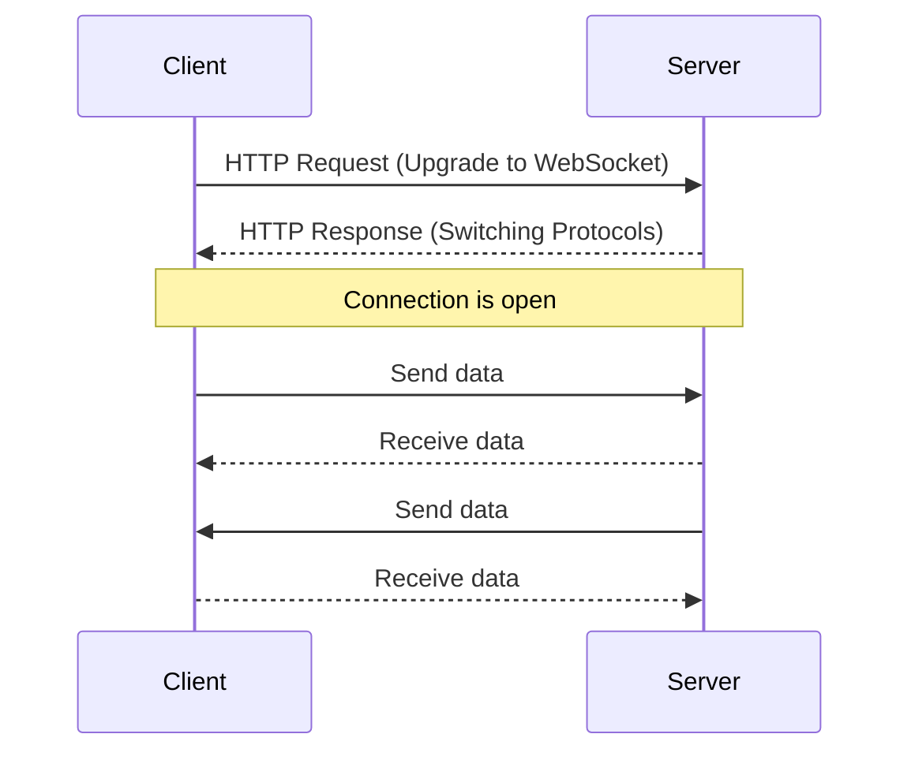

## WebSocket Diagram

```mermaid
sequenceDiagram
    participant Client
    participant Server
    Client->>Server: HTTP Request (Upgrade to WebSocket)
    Server-->>Client: HTTP Response (Switching Protocols)
    Note over Client,Server: Connection is open
    Client->>Server: Send data
    Server-->>Client: Receive data
    Server->>Client: Send data
    Client-->>Server: Receive data
```
